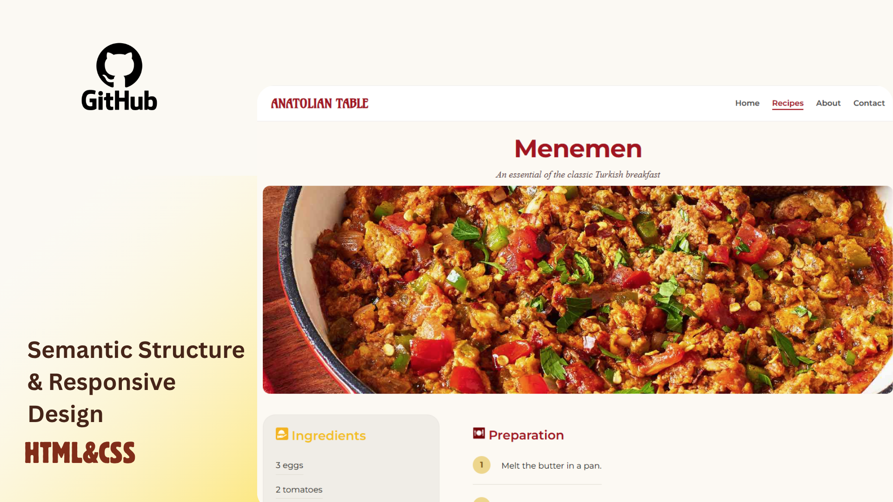

# 🍳 Anatolian Table

A responsive recipe web page showcasing traditional Turkish dishes, built with pure HTML and CSS. The featured recipe is **Menemen**, a classic Turkish breakfast made with eggs, tomatoes, and peppers.



## 📖 About

Anatolian Table is a clean, modern recipe page design. It presents a single recipe in detail — with an ingredients list and step-by-step preparation guide — alongside a selection of other traditional Turkish recipes to explore.

This project was built as a hands-on exercise in front-end fundamentals: semantic HTML structure, CSS Flexbox, CSS Grid, and responsive layout techniques.

## ✨ Features

- **Responsive layout** that adapts to different screen sizes
- **CSS Grid** used for the two-column recipe section (ingredients + preparation)
- **CSS Flexbox** used for the navigation bar, cards, and footer
- **Custom-styled ordered list** with numbered circle badges for the preparation steps
- **Hover effects** on navigation links and recipe cards (with soft shadows)
- **Google Fonts** integration (Amarante for the logo, Montserrat for body text)
- **Recipe cards** that scale equally and stay aligned

## 🛠️ Built With

- HTML5
- CSS3 (Flexbox & Grid)
- Google Fonts

## 📂 Project Structure

```
anatolian-table/
├── index.html      # Page structure and content
├── style.css       # All styling
```

## 🚀 Getting Started

To view the project locally:

1. Clone or download this repository
2. Open `index.html` in your web browser

No build tools or dependencies required — it's plain HTML and CSS.

## 🌐 Live Demo

<!-- Once you enable GitHub Pages, paste your live link here -->
_Coming soon via GitHub Pages_

## 📝 Recipe Included

**Menemen** — An essential of the classic Turkish breakfast

*Ingredients:* eggs, tomatoes, green chili peppers, butter, salt, black pepper, red pepper flakes

## 👩‍🍳 Other Recipes Featured

- Turkish Sausage & Eggs
- Omelette
- Kuymak
- Çılbır

## 📄 License

This project is open for learning and personal use.

---

*Made with ❤️ while learning HTML & CSS*
